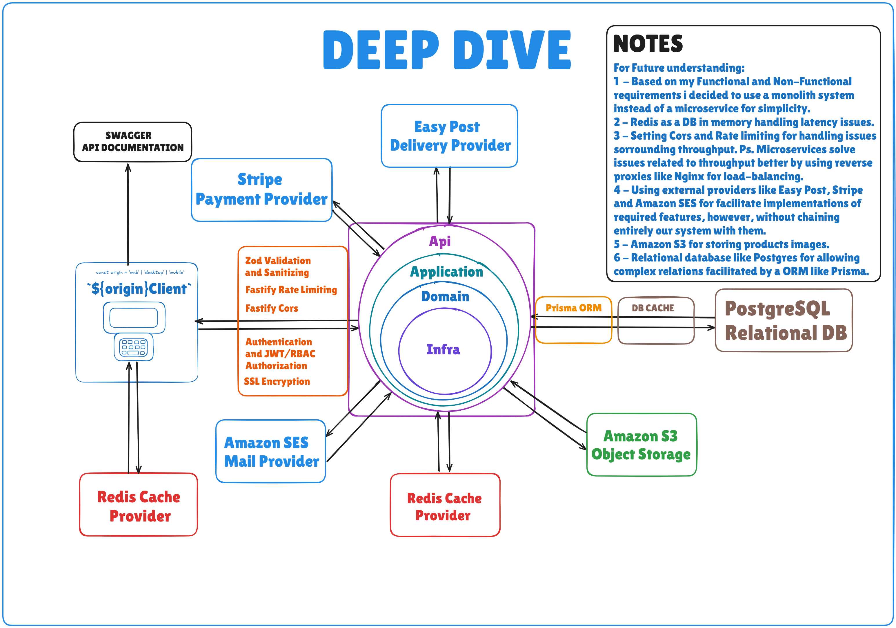

# MoonDraw - WebService
MoonDraw is an e-commerce platform surrounded by color and driven by creativity. 

# Functional Requirements 

🔒 Authentication & Authorization

Users must be able to authenticate by providing related/validated metadata and by verifying email.

Users must be able to log in and receive a secure access token (JWT) and 7 days refresh token.

The system must authorize users before accessing protected resources.

Middleware must validate tokens and enforce user roles (buyers | artists | admins).

🌐 API Security & Control

Requests must pass through CORS handling.

Rate limiting should be applied to protect public and sensitive endpoints.

🛍️ Product Management

Users can search for products using filter (name).

Users can view product details, including price, availability, and description.

Buyers can purchase products.
Artists can create, update, and delete products.
Admins can delete users and products in case of policies violation.

🧺 Shopping Cart

Buyers can add products to their cart.

Buyers can remove products from their cart.

Buyers can view the contents of their cart.

The cart must reflect real-time product availability and pricing.

💳 Checkout & Orders

Buyers can initiate a purchase from the cart.

Buyers must provide shipping and payment details at checkout.

Buyers can confirm and complete a purchase.

The system must handle order persistence, email sending, and payment processing (via provider).

Users can view past purchases and order status.
# Non-Functional Requirements

1 - The system must limit incoming throughput through strict rate-limiting policies to prevent overload, considering it operates as a monolith.

2 - The System must prioritize low latency, leveraging write-around-cache strategy wherever possible.

3 - The system must ensure seamless integration with external providers through resilient and well-defined interfaces.

4 - The system must enforce strict authorization policies to protect sensitive operations and data

5 - The system must maintain clear separation of concerns by preserving each layer’s identity and responsibility

# Core Entities & APIs 

1 - You can clone the repository

2 - Open in a IDE

3 - Install dependencies by digiting the command 'npm install' inside terminal

4 - Run the application by digiting the command 'npm run dev' inside terminal

5 - Click the link http://localhost:8000/docs or access inside your browser

# High Level Design

# Deep Dive 

# Software Design

To implement the use cases within our application, we defined several contracts—DTOs, Repositories, Providers, and Services—that collectively enable operations such as retrieving, creating, updating, and deleting various entities and managing their relationships.

To ensure a well-structured and maintainable solution, we followed Domain-Driven Design (DDD) principles. This approach emphasizes understanding the business problem in its broader context and expressing that understanding within our domain layer. Before considering how to structure the infrastructure layer or implement contracts, we first needed to validate the business logic independently.

For this reason, we adopted a Test-Driven Development (TDD) approach, ensuring that every use case scenario is thoroughly tested and that our domain remains decoupled from infrastructure dependencies.

Additionally, we incorporated several Clean Architecture principles, including patterns like repositories, composition, and dependency injection. We also followed the S.O.L.I.D principles, which challenged us to be critical and continuously improve our code:

Single Responsibility Principle (SRP): Encouraged us to respect each class's purpose, keeping responsibilities well-defined.

Open/Closed Principle (OCP): Highlighted the importance of defining contracts to keep our system extendable without modifying existing code.

Liskov Substitution Principle (LSP): Allowed us to substitute implementations easier by using Factories and Decorators without affecting layers of our application.

Interface Segregation Principle (ISP): Reinforced the need to properly use interfaces, defining contracts within DTOs and Repositories. Also making possible inheritence among different interfaces.

Dependency Inversion Principle (DIP): Helped us build a flexible and maintainable system by abstracting dependencies, ensuring business logic remains unaffected by infrastructure changes.

By adhering to these principles, we created a scalable, maintainable, and resilient e-commerce WebService.